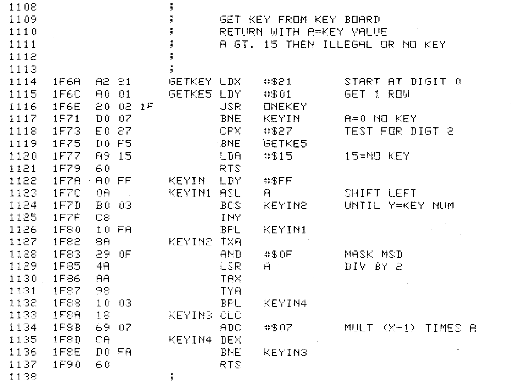

# The Keyboard tutorial

The purpose of this tutorial is to get started with the PAL-1 keyboard. The keyboard is hookup to both VIA circuit port A and port B according to the [schematics](../datasheets/PAL1_schematic.pdf). But instead of polling the keyboard lines directly we will try to reuse the build in ROM subroutine, to get some knowledge about the PAL-1 rom.

## The 6530-002 & 6530-003 Chips.

In the original KIM-1 the rom was divided between the two 6530 chips.  The rom for cassette was in the 6530-003 Chip. And the rest was in the 6530-002 Chip. In our PAL-1 board the 6530 is replaced by a rom-less, 6532 Chip, And a regular EPROM (27C64) handling the adressspace previuosly mapped to the two 6530-chips. But since all the code is places in the exact same addresspace we can still use the orignal code-listing for the 6530-002 as reference.

The full listing of the 6530-003 is avaliable in the [6530-003 listing](../datasheets/6530-003.pdf) pdf. But we will only be using this subroutine:



It seems that the routine takes no register parameters and returns a value between 0x00-0x14 in register A if a key is pressed and a value = 0x15 if no key was pressed. Also note the this subroutine does not save (push) A,X,Y registers to the stack like we did i our delay-subroutine in the spinner tutorial, this means that the callers content of A,X,Y will be destroyed! If the caller has anything of interest there it is the callers responsibility to save them.

## Then some coding
Lets do som coding.

A good practice in all coding, is to test every little bit of code before doing to much work that needs to be debugged. But how do we test some sort keyboard-code? The simple answer in this case is to reuse the framebuffer and refresh-sub-routine already tested in previous tutorial. 

So we will not explain the FB or LED_REFRESH in this tutorial go back to the [Framebuffer tutorial](../framebuffer/README.md) if you need to refresh it. It could also be good to fresh up about the LED-segment and how to calculate the value needed to light up the segment a-g, go back to the [LED display tutorial](../leddisplay/README.md). In this tutorial we will assume you understand the representation as the will go unexplained.

This program is actually very simple, since we use the build in GETKEY-subroutine. Like in the previous tutorial LED_REFRESH needs to be called frequently to keep the LED's bright and shining. So we start out main loop by doing that. Then we call GETKEY to se if any key is currently pressed. if so we branch out depending on which key was pressed, by comparing and branching if equal (BEQ). 

```
LOOP:
                JSR LED_REFRESH

                JSR GETKEY

                CMP #$5
                BEQ KEY_5
                CMP #$1             ; DOWN
                BEQ KEY_1
                CMP #$9             ; UP
                BEQ KEY_9
                CMP #$4             ; LEFT
                BEQ KEY_4
                CMP #$6             ; RIGHT
                BEQ KEY_6

                JMP LOOP
```

The handling of a keypress is to simply set a piece of the LED to represent which key was pressed. For example 4 (LEFT).

we load A with a value of 0x30 to represent segment e+f (0x10 + 0x20). We load Y with index of 0x02 to select the 3'rd LED-position of the framebuffer, and sets the framebuffer with STA FB,Y, then jumps back to do another loop refreshing & detecting

```
KEY_4:                              ; LEFT
                LDA #$30
                LDY #$02
                STA FB,Y
                JMP LOOP
```

The complete program is in [keyboard.s](./keyboard.s)

type:

    make
to build the program and convert it into papertape format.

## Lets run it!
* Hook everything up (cables and stuff)
* Reset the PAL-1 Again:
* Press RS on PAL-1
* Press Enter in Terminal
* Enter L (Capital L), (Dont press any other key after L)
* Open Sendfile dialog in your TerminalProgram. Select the file [./keyboard.ptp](./keyboard.ptp)
  And send the file as raw/binary content.
* You will see a lot of Hexformated output in the terminal.

Run the program
* type 0200+SPACE, to set the address to 0x0200, out start address
* press G (capital G) (to run the program from the current address)

The screen will start blank, since the FB-array wes initialized with 0x00. Test press 5,4,6,9,1 to test our keyboard-program.

